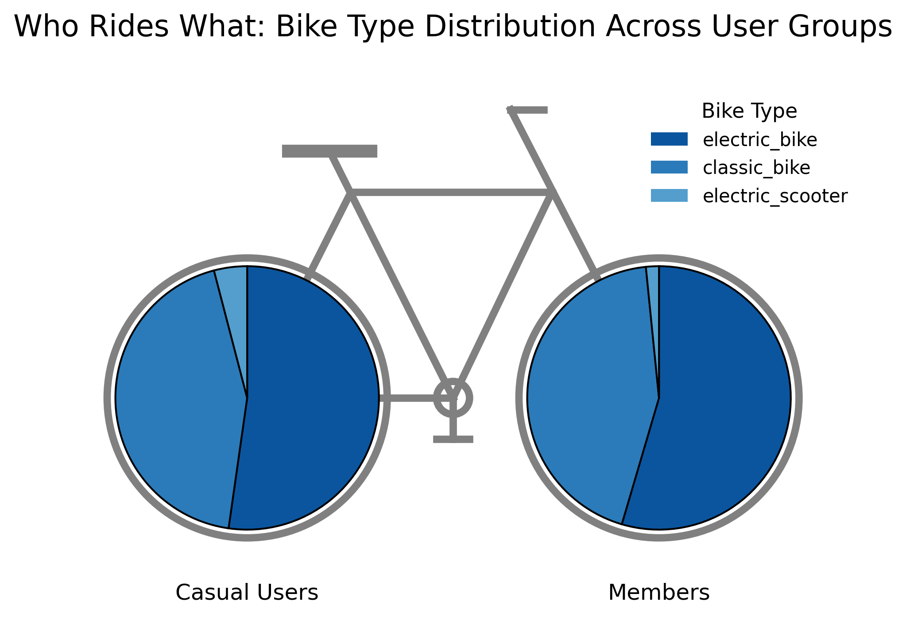
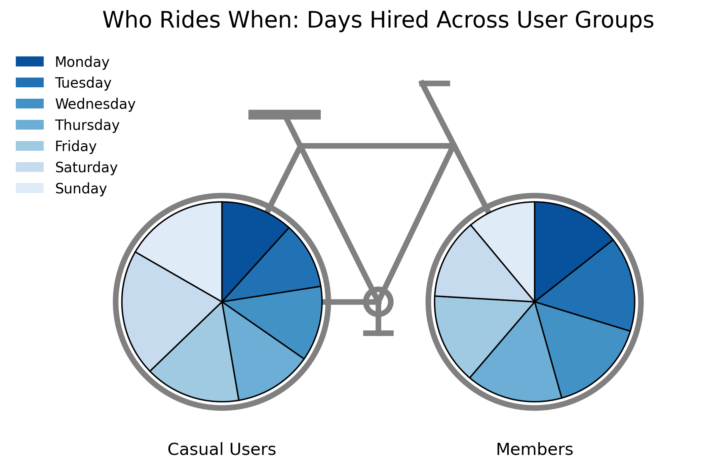
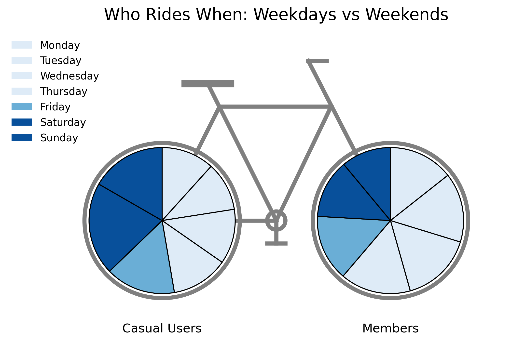
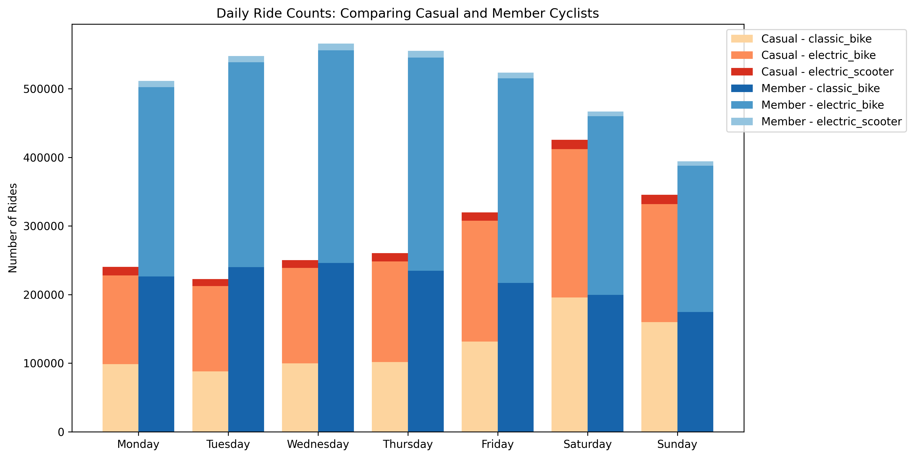
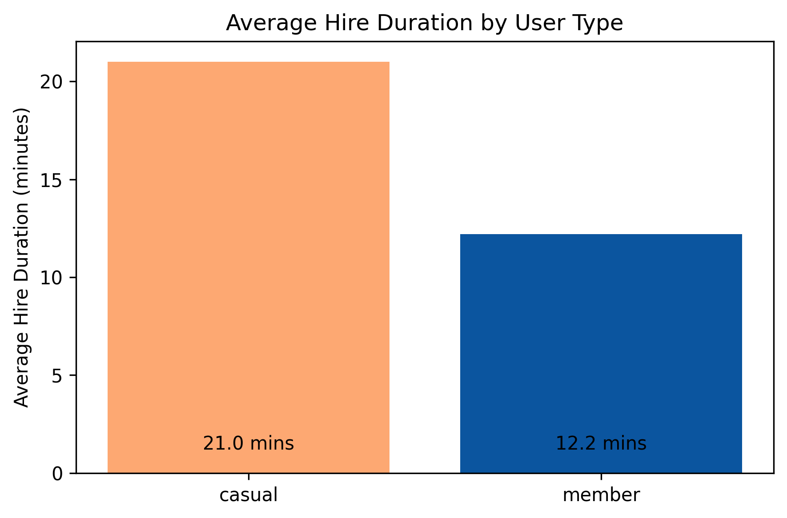
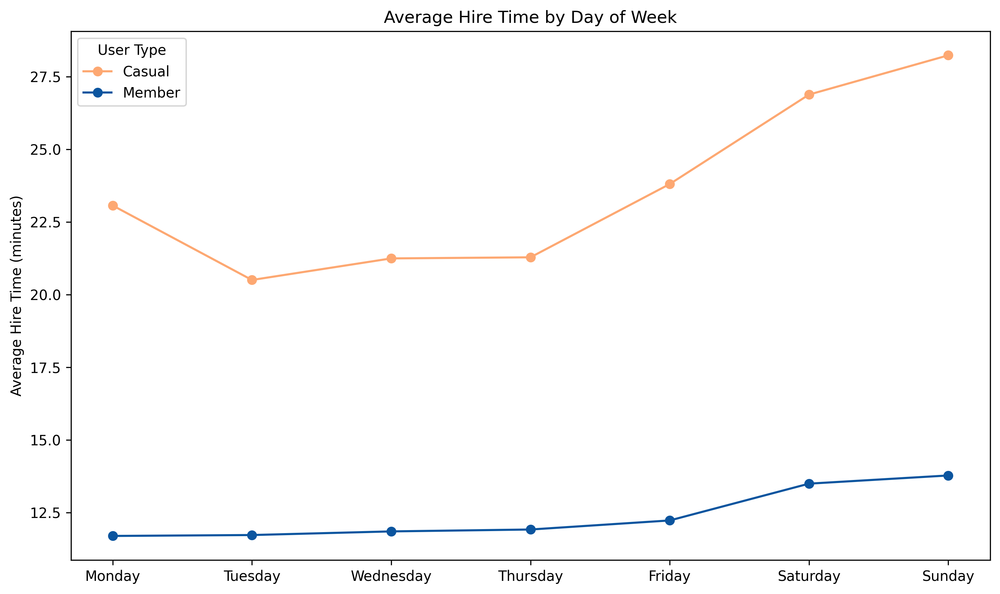
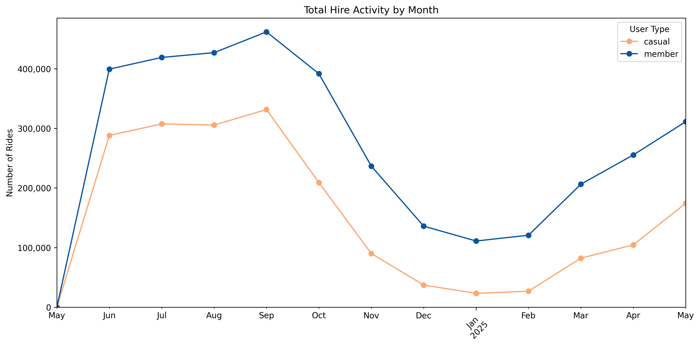
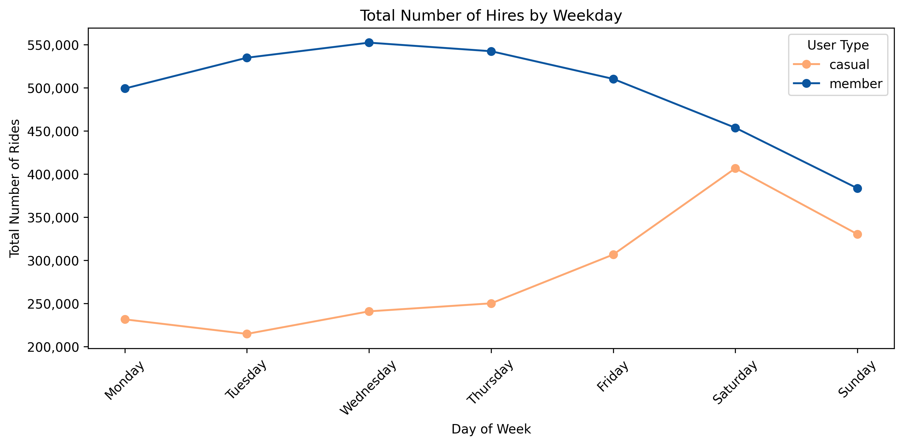

<h1 align="center">Cyclistic Bike-share Analysis</h1>
This was a Capstone project done as the final part of the Google Data Analytics Professional Certificate.

The project explores bike-share user patterns for Cyclistic, a fictional company, aiming to understand rider behavior across member and casual groups. Through data wrangling and visualisation, it uncovers insights to support marketing decision-making. The data used comes from Divvy - a Chicago based bike-share company - whose data is made available by Motivate International Inc.

## Key Objectives
- Show how annual members and casual riders use Cyclistic bikes differently.
- Analyse average ride durations across user types
- Visualise ride trends by day of week and month
- Understand bike type preferences and usage distribution
- Provide data-driven recommendations to increase membership

## Key Findings

## Summary
- Casual riders prefer weekend rides and tend to stay longer on bikes
- Members are more consistent in ride frequency, favouring weekdays
- Hire volumes peak on Saturdays
- Electric bikes are the most popular vehicle type among both groups of users
  
## Recommendations
- Offer weekend trial memberships to entice casual riders into membership
- "Upgrade and save" campaigns timed for Saturday/Sunday usage
- Tailor marketing to show that membership would save money for longer hire length.

